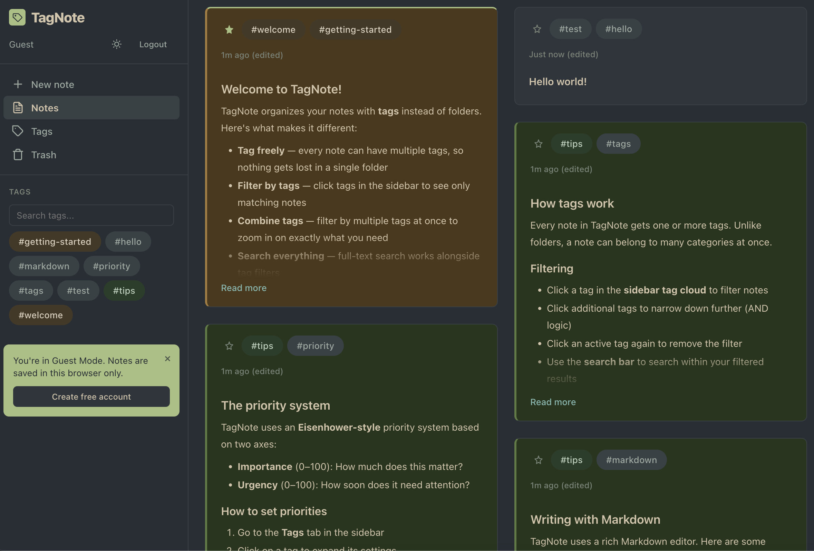

# TagNote

[](https://github.com/runminglu/tag-note/actions/workflows/ci.yml)
[](LICENSE)

TagNote is a self-hosted note-taking app organized around tags instead of folders.
Write Markdown notes, attach tags, and filter by tag intersections to build a
living stream of the ideas that matter right now.

Try the hosted app at [tag-note.com](https://tag-note.com/), or run your own
instance with Docker.



## Highlights

- Tag-first organization with AND filtering across multiple tags.
- Markdown editor with preview, image upload, and tag autocomplete.
- Full-text search using SQLite FTS5.
- Tag review, rename, merge, delete, and priority controls.
- Trash, pinning, import/export, and user settings.
- Guest mode for trying the app before creating an account.
- JWT authentication, password login, magic links, Google OAuth, and email verification.
- Admin dashboard, audit logs, `/metrics`, `/healthz`, and `/status`.
- Embedded vanilla JavaScript frontend; no frontend build step.
- Docker-first local development and deployment.

## Quick Start

```bash
cp .env.example .env
docker compose build
docker compose up -d
```

Open:

| URL | Purpose |
| --- | --- |
| `https://tag-note.com/` | Hosted TagNote app |
| `http://localhost:3777/` | Landing page |
| `http://localhost:3777/app` | TagNote app |
| `http://localhost:3777/admin` | Admin dashboard |
| `http://localhost:3777/healthz` | Public health check |
| `http://localhost:3777/status` | Operational status |
| `http://localhost:3777/metrics` | Prometheus-compatible metrics |
| `http://localhost:3778/` | Local Caddy proxy |
| `http://localhost:3778/grafana/` | Local Grafana dashboard |

To seed the local test account:

```bash
TAGNOTE_TEST_MODE=1 docker compose build
TAGNOTE_TEST_MODE=1 docker compose up -d
```

Test credentials:

| Field | Value |
| --- | --- |
| Email | `test@test.com` |
| Password | `testpass123` |

Stop the local stack without deleting data:

```bash
docker compose down
```

Do not use `docker compose down -v` unless you intentionally want to delete the
local Docker volumes and all notes stored in them.

## Configuration

Copy `.env.example` to `.env` and set values as needed.

| Variable | Required | Default | Description |
| --- | --- | --- | --- |
| `JWT_SECRET` | Production | empty | Secret used to sign JWTs. Generate with `openssl rand -hex 32`. |
| `TAGNOTE_ALLOW_DEV_SECRET` | No | `0` | Set to `1` only for local development without `JWT_SECRET`. |
| `TAGNOTE_TEST_MODE` | No | `0` | Set to `1` to create the test account at startup. |
| `TAGNOTE_DOMAIN` | Production | `notes.example.com` | Your production domain for Compose/Caddy examples. |
| `BASE_URL` | Recommended | `http://localhost:3000` | Public app URL used in generated links. |
| `ADMIN_EMAIL` | No | empty | Email address that can access `/admin`. |
| `OPERATIONAL_BEARER_TOKEN` | No | empty | Static bearer token for non-admin `/status` and `/metrics` access. |
| `GOOGLE_CLIENT_ID` | No | empty | Enables "Sign in with Google" when set. |
| `GRAFANA_ADMIN_PASSWORD` | No | `admin` | Local/monitoring Grafana admin password. |

Email is optional. If no email provider is configured, new accounts are
auto-verified and email-based flows are disabled. Supported providers are
Amazon SES, SMTP, and sendmail. See [OPERATIONS.md](OPERATIONS.md) for details.

## Development

The project is Go + Fiber + SQLite with an embedded vanilla JavaScript SPA.

```text
cmd/                  CLI tools and server entry points
internal/             application, repository, service, and handler packages
web/                  embedded HTML, CSS, JavaScript, icons, and PWA assets
monitoring/           Grafana and VictoriaMetrics configuration
release/              local build, deploy, rollback, and status scripts
tests/                Playwright end-to-end tests
```

Use Docker for local development and testing:

```bash
docker compose build
docker compose up -d
docker compose logs --tail=50
```

More testing details are in [TESTING.md](TESTING.md).

## API Overview

API routes are served under `/api/v1`. All routes except authentication require
`Authorization: Bearer <token>`.

### Authentication

| Method | Endpoint | Purpose |
| --- | --- | --- |
| `POST` | `/api/v1/auth/register` | Create an account. |
| `POST` | `/api/v1/auth/login` | Log in with email and password. |
| `POST` | `/api/v1/auth/logout` | Client-side logout helper. |
| `GET` | `/api/v1/auth/me` | Return the current user. |
| `POST` | `/api/v1/auth/google` | Log in with Google OAuth. |
| `POST` | `/api/v1/auth/verify-email` | Verify an email token. |
| `POST` | `/api/v1/auth/resend-verification` | Resend verification email. |
| `POST` | `/api/v1/auth/forgot-password` | Request password reset email. |
| `POST` | `/api/v1/auth/reset-password` | Reset password with token. |
| `POST` | `/api/v1/auth/magic-link` | Request a passwordless login link. |
| `POST` | `/api/v1/auth/verify-magic-link` | Verify a magic-link token. |

### Notes, Tags, And Settings

| Method | Endpoint | Purpose |
| --- | --- | --- |
| `GET` | `/api/v1/notes` | List notes, with optional `tag`, `q`, `sort`, `limit`, and `offset`. |
| `POST` | `/api/v1/notes` | Create a note. |
| `GET` | `/api/v1/notes/stream` | Render filtered notes as Markdown. |
| `GET` | `/api/v1/notes/export` | Export notes, tags, trash, and settings. |
| `POST` | `/api/v1/notes/import` | Import exported data. |
| `GET` | `/api/v1/notes/trash` | List trashed notes. |
| `GET` | `/api/v1/notes/:id` | Get one note. |
| `PUT` | `/api/v1/notes/:id` | Update one note. |
| `PUT` | `/api/v1/notes/:id/pin` | Toggle pin state. |
| `PUT` | `/api/v1/notes/:id/restore` | Restore a trashed note. |
| `DELETE` | `/api/v1/notes/:id` | Move a note to trash. |
| `DELETE` | `/api/v1/notes/:id/permanent` | Permanently delete a note. |
| `GET` | `/api/v1/tags` | List tag names. |
| `GET` | `/api/v1/tags/detailed` | List tags with status, counts, and priority. |
| `GET` | `/api/v1/tags/autocomplete` | Autocomplete tags with `q`. |
| `PUT` | `/api/v1/tags/approve-all` | Approve all unreviewed tags. |
| `PUT` | `/api/v1/tags/:name/approve` | Approve one tag. |
| `PUT` | `/api/v1/tags/:name/rename` | Rename or merge a tag. |
| `PUT` | `/api/v1/tags/:name/priority` | Set importance and urgency. |
| `DELETE` | `/api/v1/tags/:name` | Delete a tag without deleting notes. |
| `GET` | `/api/v1/settings` | Get user settings. |
| `PUT` | `/api/v1/settings` | Save user settings. |
| `POST` | `/api/v1/images` | Upload an image. |

### Health, Status, And Admin

| Method | Endpoint | Purpose |
| --- | --- | --- |
| `GET` | `/healthz` | Minimal public liveness status. |
| `GET` | `/status` | Basic app and database statistics. |
| `GET` | `/metrics` | Prometheus-compatible metrics. |
| `GET` | `/admin` | Admin dashboard UI. |
| `GET` | `/api/v1/admin/overview` | Admin overview data. |
| `GET` | `/api/v1/admin/users` | Admin user list. |
| `GET` | `/api/v1/admin/logs` | Admin audit logs. |

`/status` and `/metrics` require either an admin JWT bearer token or
`OPERATIONAL_BEARER_TOKEN`.

## Attachment Privacy

Notes, tags, settings, and trash are account-scoped. Uploaded image files are
stored under random filenames and embedded in notes as `/uploads/...` URLs.
Treat those image URLs as link-private: anyone who obtains a file URL can fetch
that specific file. Do not upload sensitive attachments unless your deployment
adds authenticated media serving.

## CLI Tools

The Docker image includes HTTP client CLIs that talk to the running server:

```bash
docker compose exec tagnote tagnote-login
docker compose exec tagnote tagnote-add -t project "Build the next feature"
docker compose exec tagnote tagnote-read -t project
docker compose exec tagnote tagnote-logs -s "keyword"
docker compose exec tagnote tagnote-tags
docker compose exec tagnote tagnote-delete <id>
```

For remote servers, set `TAGNOTE_URL` and `TAGNOTE_TOKEN` in the environment
where the CLI runs.

## Documentation

- [CONTRIBUTING.md](CONTRIBUTING.md) - contribution workflow and standards.
- [TESTING.md](TESTING.md) - local, API, and browser testing.
- [OPERATIONS.md](OPERATIONS.md) - deployment, backups, monitoring, and recovery.
- [release/README.md](release/README.md) - release script workflow.
- [SECURITY.md](SECURITY.md) - supported versions and vulnerability reporting.
- [CHANGELOG.md](CHANGELOG.md) - release history.

## Contributing

Contributions are welcome. Please read [CONTRIBUTING.md](CONTRIBUTING.md) before
opening a pull request.

## License

TagNote is released under the [MIT License](LICENSE).
